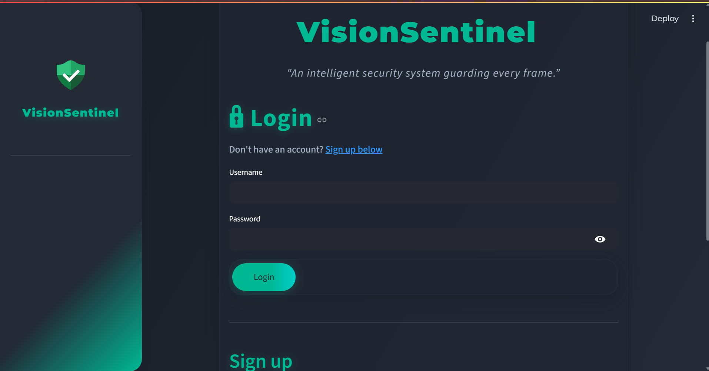
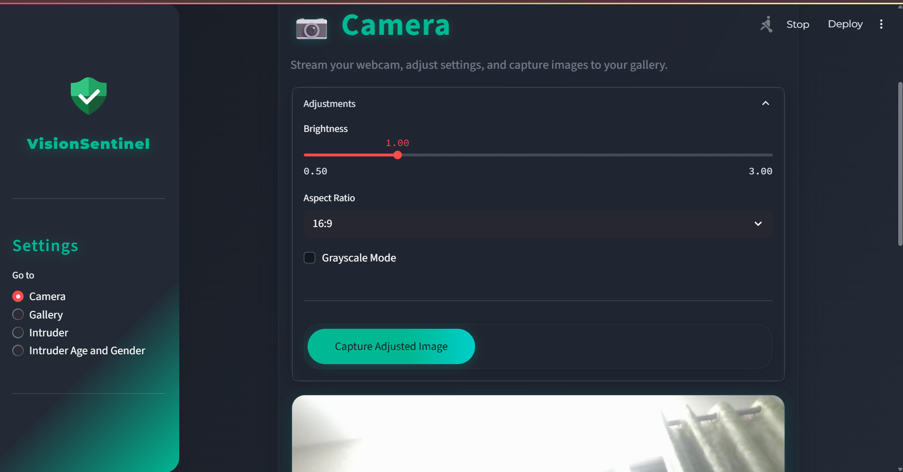
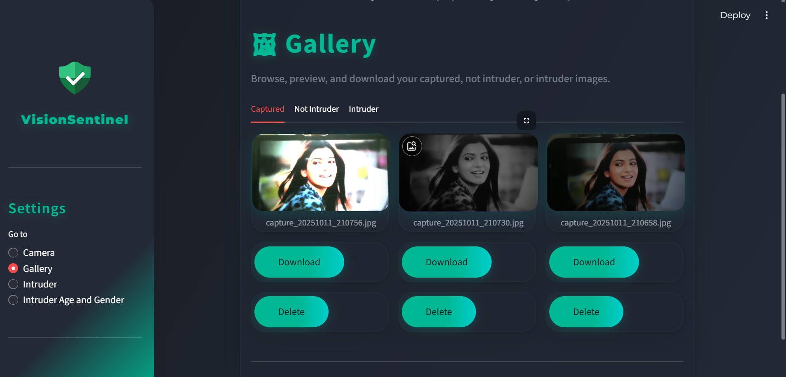
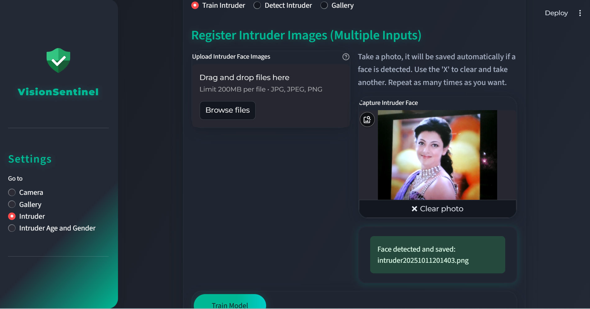
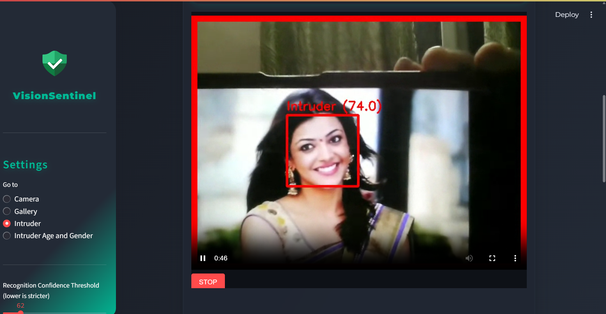
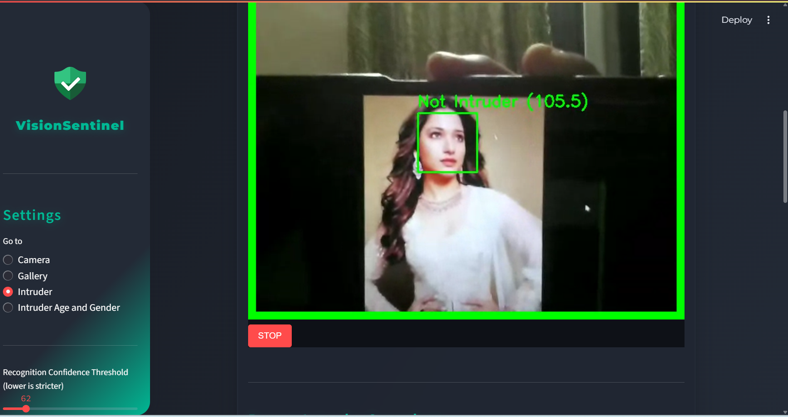
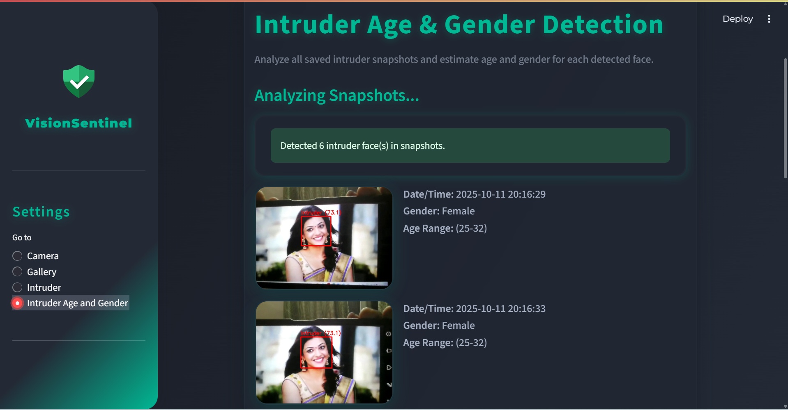

# 🧭 


## 🏷️1. Project Title

VisionSentinel – AI-Based Intruder Detection System.

## 💡2. Description / Overview

VisionSentinel is an AI-powered intruder detection system built using Streamlit. It utilizes real-time webcam input or uploaded images to detect faces, recognize intruders, and predict age and gender. This system enhances security by automatically analyzing entrants and maintaining a visual detection record. Its interface is designed for simple, elegant management of live detection, gallery viewing, and image storage.

## ⚙️3. Features

- 🔐 **Authentication:** Secure login & signup with SQLite database storage and hashed passwords.
- 🌗 **Adjustable Camera Settings:**
  - Real-time brightness control
  - Switch aspect ratio (1:1, 4:3, 16:9)
  - Grayscale (low-light mode)
- 🔴 **Intruder Detection:** Identifies and classifies faces as intruders or recognized users.
- 🧑‍🤝‍🧑 **Age & Gender Prediction:** AI-driven age and gender estimates.
- 📸 **Automatic Image Saving:** All detected faces are saved and organized.
- 🗂️ **Gallery View:** Easy browsing of captured intruder/non-intruder images.
- 🎥 **Webcam & Upload Support:** Works with live camera feed or static uploads.
- 🖤 **Professional Dark-Themed UI:** Minimalist and accessible design.

## 🧰 4. Tech Stack / Tools Used

- 🐍 **Python**  
- 🎛️ **Streamlit:** Frontend web interface  
- 👁️ **OpenCV:** Camera and image handling  
- 🧠 **DeepFace:** Age & gender prediction  
- 🧩 **face_recognition:** Intruder detection  
- 📁 **os, datetime:** File naming and organizational routines.

## 🚀5. Installation / Setup Instructions

### Prerequisites

- Python (3.7+ recommended)

### Installation Steps

```bash
# Clone the repository
git clone https://github.com/Sowmya-Kolli/VisionSentinel.git

# Navigate to the project folder
cd VisionSentinel

# Install dependencies
pip install -r requirements.txt

# Run the Streamlit app
streamlit run app.py
```


## 📸6. Screenshots / Demo

- #### 🏠 1. Landing Page / Login

    
    Shows the application’s landing page for login or signup.  
    💡 Ensures authorized access before using camera or gallery features.


- #### 🎥 2. Camera Settings

    
    Adjust brightness, ratio, and grayscale before capturing images.   
    💡 Helps optimize camera conditions for better training or detection accuracy.

- #### 🖼️ 3. Captured Images Gallery

    
    Displays all camera-captured images in a dedicated gallery.       
    💡 Helps users review and manage previously captured images.

- #### 🧠 4. Train Intruder

    
    Capture and label photos of intruders for model training.    
    💡 Enables the AI to learn and recognize suspicious persons.

- #### 🚨 5. Detect Intruder (Intruder Found)

    
    Demonstrates detection of a trained intruder with accuracy metrics.    
    💡 Identifies intruders in real-time using facial recognition.

- #### ✅ 6. Detect Intruder (Authorized User)

    
    Detects a normal user correctly as *Not Intruder*.   
    💡 Confirms model’s accuracy in distinguishing known vs unknown faces.

- #### 👤 7. Intruder Age & Gender Prediction

    
    Displays **age, gender, and detection date** of the detected intruder.    
    💡 Provides analytics for better profiling and alerts.


- #### 👤8. Not Intruder Gallery**  
    
  Easily browse and manage photos of authorized users (not intruders) within a dedicated section of the gallery.


> Additional: The gallery system captures images from various points and keeps them sorted for future model retraining and administrative review.[1]

## 🧠7. How It Works / Usage

1️⃣ **Launch the App**
Open your browser at [http://localhost:8501](http://localhost:8501)

2️⃣ **Signup or Login**
Create an account and log in to access the dashboard.

3️⃣ **Setup Camera**
Go to *Camera Settings* from the sidebar.

4️⃣ **Start Detection**
Choose *Intruder Detection* to begin live facial analysis.

* Detects faces in real-time
* Predicts age and gender
* Classifies as **Intruder** or **Not Intruder**

5️⃣ **Auto-Save Feature**
Detected images are saved automatically:

```
gallery/intruder/       → Intruder images  
gallery/not_intruder/   → Normal user images
```

6️⃣ **View Saved Images**
Browse all past captures in the *Gallery Section* of the app.

---

## 🗂️ 8. Folder Structure

```
VisionSentinel/
│
├── app.py                   # Main Streamlit app
├── users.json               # Registered user database
├── intruder_lbph.yml        # Trained face recognition model
│
├── age_deploy.prototxt      # Age model config
├── age_net.caffemodel       # Age model weights
├── gender_deploy.prototxt   # Gender model config
├── gender_net.caffemodel    # Gender model weights
│
├── gallery/                 # Captured images
├── intruder_faces/          # Cropped intruder faces
├── intruder_snapshots/      # Full-frame intruder shots
└── not_intruder_snapshots/  # Approved user images
├── requirements.txt         # Dependencies
```


## 👩‍💻 **9. Developer**

**Developed by:**
🧑‍💻 **KOLLI SOWMYA**  
🎓 Department of Computer Science Engineering  
📁 Project Category: **AI/ML + Computer Vision (Streamlit-Based)**

---

⭐ **If you like this project, don’t forget to star it on GitHub!**  
✨ *Smart Security. Simplified with VisionSentinel.*

---


